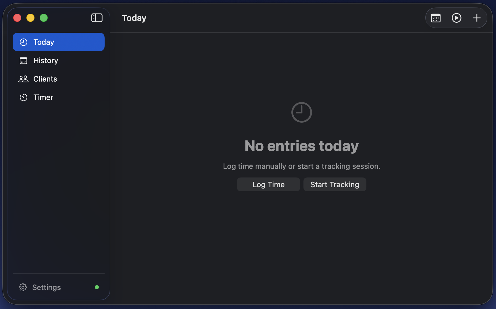
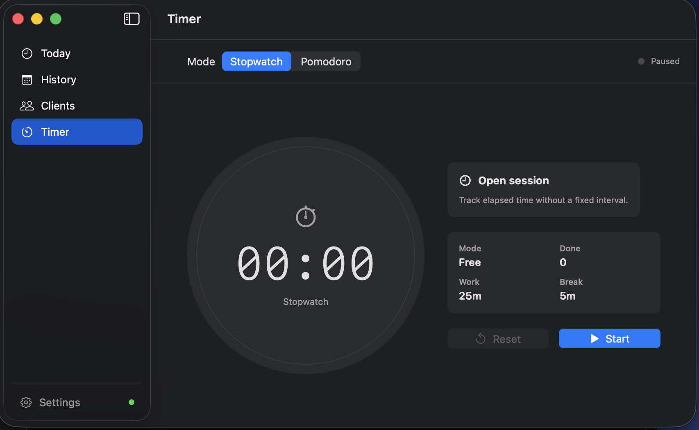
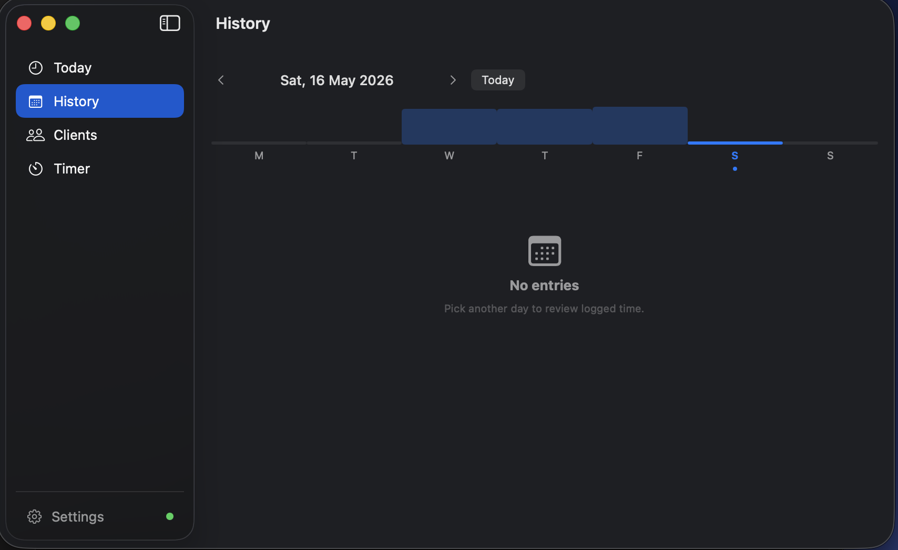
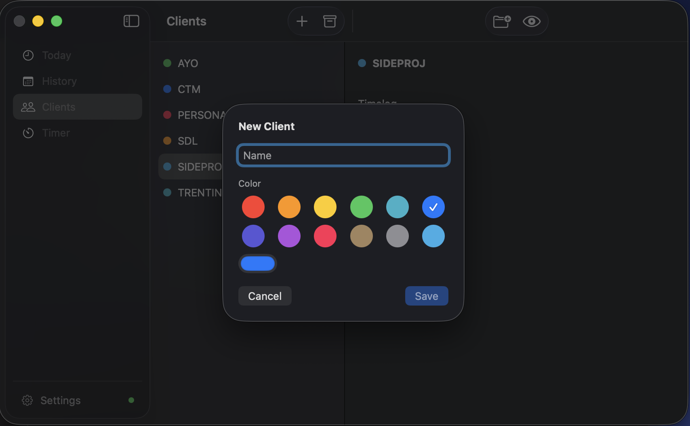

<p align="center">
  
</p>

<h1 align="center">Timelog</h1>

<p align="center">
  A lightweight time-tracking app for iOS and native macOS, built with SwiftUI and SwiftData.<br/>
  Sync across devices via a self-hosted middleware on Vercel — zero cloud lock-in, zero subscription.
</p>

<p align="center">
  
  
  
  
  
  
  
</p>

---

## Screenshots

<p align="center">
  
  
</p>
<p align="center">
  
</p>
<p align="center">
  
</p>

---

## Apps

| App | Platform | Description |
|-----|----------|-------------|
| **Timelog** (iOS) | iPhone / iPad | Full-featured mobile app with Live Activity, splash screen, auto-sync |
| **TimelogMac** (macOS) | macOS 14+ | Native menu bar app with full window management and MongoDB sync |

Both apps share business logic via **TimelogCore**, a local Swift Package in the same repo.

---

## iOS Features

| Tab | Description |
|-----|-------------|
| **Today** | Log time manually or start real-time sessions; live daily total |
| **Clients** | Manage clients (color coded) and their projects; archive when done |
| **Timer** | Stopwatch or Pomodoro with ring progress and lock-screen notification |
| **Settings** | Pomodoro intervals, daily reminders, smart tracking config, sync status |
| **Language** | English and Italian — follows the system locale automatically |
| **Multi-user** | Each person picks a nickname on first launch — data is fully isolated per user on a shared cluster |
### Smart Tracking
Tap ▶ to start a session when you begin working. Stop it when done — duration is logged automatically. Multiple sessions can run simultaneously. Forgot to stop? You get a notification at your configured end-of-day time.

### Sync (iOS ↔ macOS)
Data entered on Mac is available on iPhone automatically. The iOS app pulls from a lightweight Node.js middleware on Vercel at every launch and pushes changes with a 2-second debounce. The connection string never leaves the server.

### Live Activity (iOS)
Active sessions and the running timer appear on the lock screen and in the Dynamic Island — no need to open the app.

---

## macOS Features

- **Menu bar icon** — always visible; shows live elapsed time while timer is running
- **Today view** — active sessions with live ticker, today's entries, context menus
- **Clients & Projects** — `NavigationSplitView` with macOS `Table`, inline create/edit forms
- **Timer** — full Pomodoro / stopwatch window, Space to start/pause
- **Auto-updates via Sparkle** — one-click in-app updates, EdDSA-signed DMG; "Check for Updates…" in the app menu. No Apple Developer ID required
- **REST sync** — push/pull via `RestSyncService` + real-time SSE; connection string stored in Keychain
- **Multi-user** — each team member picks a nickname on first launch; data is isolated per user, one shared cluster
- **Settings window** — Pomodoro config, smart tracking end-of-day threshold (`⌘,`)
- **Localization** — English and Italian; system locale followed automatically

---

## Sync Architecture

```
iPhone ──► GET /api/pull   ──► Vercel (Node.js) ──► MongoDB Atlas
Mac    ──► GET /api/pull   ──► Vercel (Node.js) ──► MongoDB Atlas
        ◄── JSON ───────────────────────────────────────────────

Both   ──► POST /api/sync  ──► Vercel ──► MongoDB upsert

Both   ──► GET /api/events ──► Vercel SSE ──► MongoDB Change Streams
```

- **iOS + macOS**: `RestSyncService` — pure `URLSession`, zero direct database connections from the clients
- **Real time**: `SSEClient` listens to `GET /api/events` and triggers `pullAll(into:)` after MongoDB Change Stream events
- **Server**: Vercel functions (`GET /api/pull`, `POST /api/sync`, `GET /api/events`), auth via `X-API-Key`
- **User isolation**: every document carries a `userId` field (the user's nickname); each device only pulls and pushes its own records
- **API docs**: live Swagger UI at your Vercel deployment URL

---

## Repo Structure

```
TimeLog/
├── Timelog.xcodeproj           # iOS app project
├── TimelogMac.xcodeproj        # macOS app project
├── TimelogCore/                # Shared Swift Package
│   └── Sources/
│       ├── TimelogCore/        # Models, VM, Stores, Helpers, Extensions
│       └── TimelogSync/        # RestSyncService + SSEClient for iOS and macOS
├── Timelog/                    # iOS app sources (Views only)
├── TimelogMac/                 # macOS app sources (Views only)
├── server/                     # Vercel middleware (Node.js + TypeScript)
│   └── api/
│       ├── pull.ts             # GET  /api/pull
│       ├── sync.ts             # POST /api/sync
│       └── events.ts           # GET  /api/events
└── docs/
    ├── SETUP_SYNC_SERVER.md    # How to configure sync on a new machine
    └── audit/                  # Performance, stability, release readiness
```

---

## Requirements

| App | Requirement |
|-----|-------------|
| iOS | Xcode 16+, iOS 17+, physical device for Live Activity |
| macOS | Xcode 16+, macOS 14+ |
| Sync server | Node.js 18+, Vercel account (free), MongoDB Atlas (free M0) |

---

## Getting Started

```bash
git clone https://github.com/AlbertoBarrago/Timelog.git
cd Timelog
```

**iOS:** open `Timelog.xcodeproj`, select the `Timelog` scheme, run on device or simulator.

**macOS:** open `TimelogMac.xcodeproj`, select the `TimelogMac` scheme, run.

### Sync setup

See [`docs/SETUP_SYNC_SERVER.md`](docs/SETUP_SYNC_SERVER.md) for full instructions. Quick version:

```bash
# 1. Deploy the middleware
cd server && vercel --prod

# 2. Set env vars on Vercel
vercel env add MONGODB_URI
vercel env add API_KEY

# 3. Configure iOS credentials (gitignored, auto-loaded at launch)
echo "URL=https://your-app.vercel.app"  > Timelog/SyncConfig.local
echo "API_KEY=your-secret-key"         >> Timelog/SyncConfig.local

# 4. Configure macOS credentials
mkdir -p ~/.config/timelog
echo "URL=https://your-app.vercel.app"  > ~/.config/timelog/sync.local
echo "API_KEY=your-secret-key"         >> ~/.config/timelog/sync.local
chmod 600 ~/.config/timelog/sync.local
```

---

## Architecture

- **TimelogCore** — shared `@Observable` models and business logic, public API, iOS 17+ / macOS 14+
- **MVVM** — `TimerViewModel` lives at app level, injected via SwiftUI environment
- **SwiftData** — single `ModelContainer` shared across all scenes
- **Keychain** — all sync credentials stored via `KeychainHelper`, never in code or UserDefaults
- **ActivityKit** — Live Activities managed by `TimerViewModel` (iOS only, compile-guarded)
- **UserNotifications** — daily reminders, session overdue alerts, Pomodoro phase-end

---

## Testing

```bash
# Unit tests del package (no Xcode required)
(cd TimelogCore && swift test)

# Local macOS app run with tests, build, launch, and log streaming
scripts/run-local-mac.sh
```

Per i test che richiedono l'app bundle (Keychain, Notifications), usa **⌘U** in Xcode sul scheme `Timelog`.

| Target | Suite | Runner |
|--------|-------|--------|
| `TimelogCoreTests` | `Int.formattedDuration`, `Color+Hex`, `Client`, `ActiveSession` | `swift test` |
| `TimelogTests` | `KeychainHelper`, `SettingsStore`, `TimerViewModel` | Xcode ⌘U |

---

## Changelog

See [CHANGELOG.md](CHANGELOG.md).

---

## Contributing

1. Branch off `main`
2. Keep one feature per PR

---

## Credits

Built by [Alberto Barrago](https://github.com/AlbertoBarrago) (alBz) with [Claude](https://claude.ai) as co-pilot.
