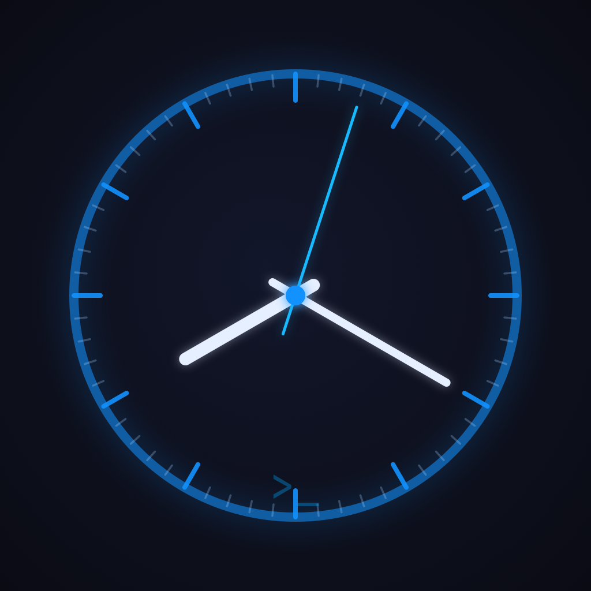

<p align="center">
  
</p>

<h1 align="center">Timelog</h1>

<p align="center">
  A lightweight time-tracking app for iOS and native macOS, built with SwiftUI and SwiftData.
</p>

---

## Apps

| App | Platform | Description |
|-----|----------|-------------|
| **Timelog** (iOS) | iPhone / iPad | Full-featured mobile app with Live Activity on lock screen |
| **TimelogMac** (macOS) | macOS 14+ | Native menu bar app with full window management |

Both apps share business logic via **TimelogCore**, a local Swift Package in the same repo.

---

## iOS Features

| Tab | Description |
|-----|-------------|
| **Today** | Log time manually or start real-time sessions; live daily total |
| **Clients** | Manage clients (color coded) and their projects; archive when done |
| **Timer** | Stopwatch or Pomodoro with ring progress and lock-screen notification |
| **Settings** | Wethod API, Pomodoro intervals, daily reminders, smart tracking config |

### Smart Tracking
Tap ▶ to start a session when you begin working. Stop it when done — duration is logged automatically. Multiple sessions can run simultaneously. Forgot to stop? You get a notification at your configured end-of-day time.

### Reminders
Set a daily nudge at a chosen time on chosen days so nobody on your team forgets to fill in their timesheet.

### Live Activity (iOS)
Active sessions and the running timer appear on the lock screen and in the Dynamic Island — no need to open the app.

---

## macOS Features

- **Menu bar icon** — always visible; shows live elapsed time while timer is running
- **Today view** — active sessions with live ticker, today's entries, context menus
- **Clients & Projects** — `NavigationSplitView` with macOS `Table`, inline create/edit forms
- **Timer** — full Pomodoro / stopwatch window, Space to start/pause
- **Settings window** — Pomodoro config, smart tracking end-of-day threshold (`⌘,`)

---

## Repo Structure

```
TimeLog/
├── Timelog.xcodeproj          # iOS app project
├── TimelogMac.xcodeproj       # macOS app project
├── TimelogCore/               # Shared Swift Package (models, stores, VM, helpers)
│   └── Sources/TimelogCore/
│       ├── Models/            # Client, Project, TimeEntry, ActiveSession
│       ├── ViewModels/        # TimerViewModel
│       ├── Stores/            # SettingsStore
│       ├── Helpers/           # KeychainHelper, NotificationManager
│       └── Extensions/        # Color+Hex, Int+Duration
├── Timelog/                   # iOS app sources
│   └── Views/
│       ├── Home/              # Today log, QuickLogSheet, StartTracking, StopSession
│       ├── Timer/             # Stopwatch / Pomodoro + ring
│       ├── Clients/           # Client & project management
│       ├── Settings/          # Config, reminders, export
│       └── Onboarding/        # First-run guide
├── TimelogMac/                # macOS app sources
│   └── Views/
│       ├── MainMacView        # NavigationSplitView root
│       ├── TodayMacView       # Sessions + entries
│       ├── ClientsMacView     # Clients → Projects table
│       ├── TimerMacView       # Full timer window
│       ├── MenuBarView        # Menu bar popover
│       └── ...
└── TimelogWidgetExtension/    # iOS Live Activity widget
```

---

## Requirements

| App | Requirement |
|-----|-------------|
| iOS | Xcode 16+, iOS 17+, physical device for Live Activity |
| macOS | Xcode 16+, macOS 14+ |

No external dependencies — pure Swift ecosystem (SwiftData, Keychain, ActivityKit, UserNotifications).

---

## Getting Started

```bash
git clone https://github.com/AlbertoBarrago/Timelog.git
cd Timelog
```

**iOS:** open `Timelog.xcodeproj`, select the `Timelog` scheme, run on device or simulator.

**macOS:** open `TimelogMac.xcodeproj`, select the `TimelogMac` scheme, run.

> Both projects reference `TimelogCore` as a local package — no extra setup needed.

**Wethod integration**: add your Base URL and API Key in Settings — stored securely in the Keychain.

**Live Activity**: requires iPhone 14 Pro or later for Dynamic Island; any iPhone for lock screen banner.

---

## Architecture

- **TimelogCore** — shared `@Observable` models and business logic, public API, iOS + macOS 14+
- **MVVM** — `TimerViewModel` lives at app level, injected via SwiftUI environment
- **SwiftData** — single `ModelContainer` shared across all scenes (window + menu bar)
- **Keychain** — Wethod API key never stored in UserDefaults
- **ActivityKit** — Live Activities managed by `TimerViewModel` (iOS only, compile-guarded)
- **UserNotifications** — daily reminders, session overdue alerts, Pomodoro phase-end

---

## Changelog

See [CHANGELOG.md](CHANGELOG.md).

---

## Contributing

1. Branch off `main`
2. Keep one feature per PR
3. Run UI tests before opening a PR (`⌘U`)

---

## Credits

Built by [Alberto Barrago](https://github.com/AlbertoBarrago) (alBz) with [Claude](https://claude.ai) as co-pilot.
