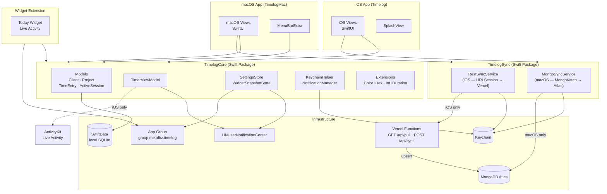
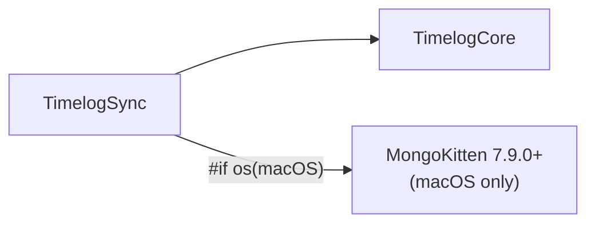

# Architecture

## Monorepo Structure

The repository contains two native apps and a shared Swift package.

```
TimeLog/
├── TimeLog.xcworkspace          ← Xcode entry point
├── Timelog.xcodeproj            ← iOS app
├── TimelogMac.xcodeproj         ← macOS app
├── TimelogCore/                 ← shared Swift Package
│   └── Sources/
│       ├── TimelogCore/         ← models, VM, stores, helpers
│       └── TimelogSync/         ← MongoSyncService (macOS) + RestSyncService (iOS)
├── Timelog/                     ← iOS Views
├── TimelogMac/                  ← macOS Views
├── TimelogWidgetExtension/      ← Widget + Live Activity (iOS)
└── server/                      ← Vercel middleware (Node.js/TypeScript)
    └── api/
        ├── pull.ts              ← GET  /api/pull
        └── sync.ts              ← POST /api/sync
```

## Application Layers



## Architectural Rules

| Rule | Rationale |
|------|-----------|
| Business logic only in `TimelogCore` | Apps contain exclusively Views |
| Everything `public` in TimelogCore | Visible from both apps and the widget |
| One `ModelContainer` per app | Avoids SwiftData conflicts; on macOS it is `static let` shared between WindowGroup and MenuBarExtra |
| iOS uses `RestSyncService`, macOS uses `MongoSyncService` | iOS cannot use MongoKitten (ARM-only binary, heavy dependencies); the same public signature separates the implementations |
| `#if os(iOS)` for ActivityKit and UIKit haptics | Do not use `#if targetEnvironment(macCatalyst)` — the project does not use Catalyst |
| `deletedAt: Date?` on Client, Project, TimeEntry | Soft delete: deleted records are marked but not removed from the database until sync has propagated them to all devices. `ActiveSession` has no `deletedAt` because it is always converted to a `TimeEntry` on stop. |

## Package Dependencies



## Entry Points by Platform

### iOS — `TimelogApp.swift`
```
App
 └─ ModelContainer (Client, Project, TimeEntry, ActiveSession)
     └─ ZStack
         ├─ ContentView
         │   ├─ TabBar: Today · Clients · Timer · Settings
         │   ├─ RestSyncSetup (modifier — pull on launch, push debounced 2s)
         │   └─ SyncFlashOverlay (modifier — green flash + haptic on sync)
         └─ SplashView (fades after initial animation)
```

### macOS — `TimelogMacApp.swift`
```
App
 ├─ static ModelContainer (shared)
 ├─ WindowGroup "main"
 │   └─ MainMacView
 │       ├─ NavigationSplitView: Today · Clients · Tracking · Settings
 │       └─ MongoSyncSetup (modifier — connects and starts auto-sync)
 ├─ MenuBarExtra
 │   └─ MenuBarView (window style)
 │       └─ MenuBarStatusLabel (shows timer if running)
 └─ Settings (⌘,)
     └─ MacSettingsView
```
