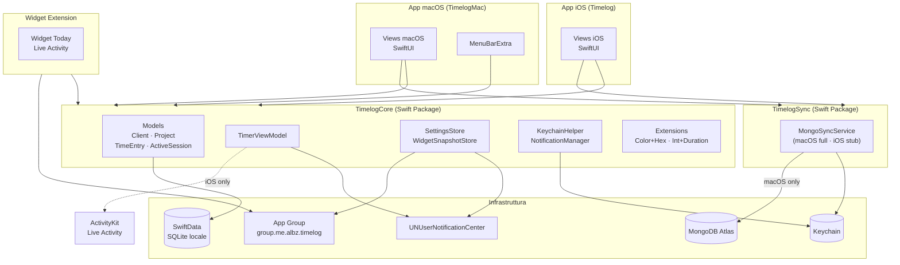
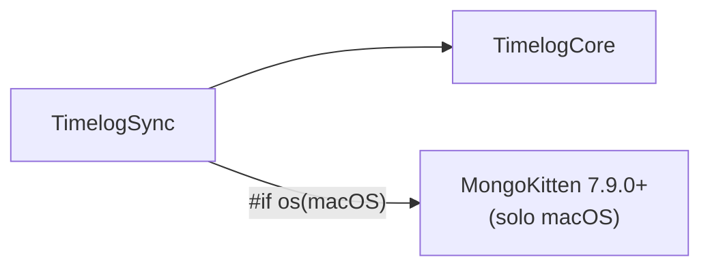

# Architettura

## Struttura Monorepo

Il repository contiene due app native e un package Swift condiviso.

```
TimeLog/
├── TimeLog.xcworkspace          ← punto di ingresso Xcode
├── Timelog.xcodeproj            ← app iOS
├── TimelogMac.xcodeproj         ← app macOS
├── TimelogCore/                 ← Swift Package condiviso
│   └── Sources/
│       ├── TimelogCore/         ← modelli, VM, stores, helpers
│       └── TimelogSync/         ← integrazione MongoDB (macOS)
├── Timelog/                     ← Views iOS
├── TimelogMac/                  ← Views macOS
└── TimelogWidgetExtension/      ← Widget + Live Activity (iOS)
```

## Layer dell'applicazione



## Regole architetturali

| Regola | Motivazione |
|--------|-------------|
| Business logic solo in `TimelogCore` | Le app contengono esclusivamente Views |
| Tutto `public` in TimelogCore | Visibile da entrambe le app e dalla widget |
| Un solo `ModelContainer` per app | Evita conflitti SwiftData; in macOS è `static let` condiviso tra WindowGroup e MenuBarExtra |
| `TimelogSync` dipende da MongoKitten **solo su macOS** | Riduce il binary size iOS; su iOS MongoSyncService è uno stub no-op |
| `#if os(iOS)` per ActivityKit e UIKit haptics | Non usare `#if targetEnvironment(macCatalyst)` — il progetto non usa Catalyst |

## Dipendenze Package



## Entry point per piattaforma

### iOS — `TimelogApp.swift`
```
App
 └─ ModelContainer (Client, Project, TimeEntry, ActiveSession)
     └─ ContentView
         ├─ TabBar: Today · Clients · Timer · Settings
         └─ MongoSyncSetup (modifier — stub)
```

### macOS — `TimelogMacApp.swift`
```
App
 ├─ static ModelContainer (condiviso)
 ├─ WindowGroup "main"
 │   └─ MainMacView
 │       ├─ NavigationSplitView: Today · Clients · Tracking · Settings
 │       └─ MongoSyncSetup (modifier — connette e avvia auto-sync)
 ├─ MenuBarExtra
 │   └─ MenuBarView (window style)
 └─ Settings (⌘,)
     └─ MacSettingsView
```
