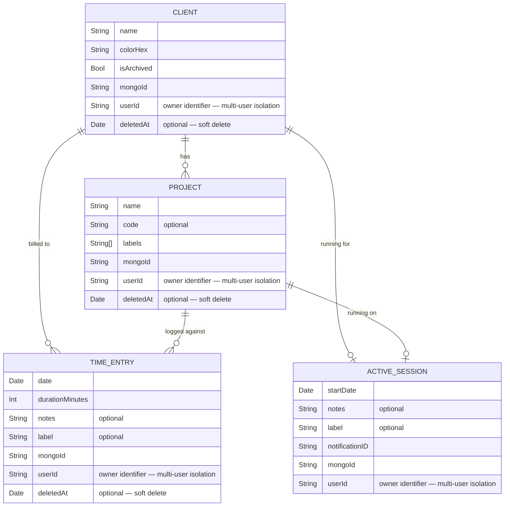
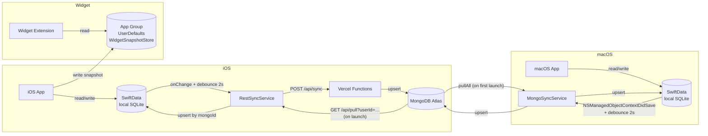

# Data Model

## Entities and relationships



## Entity descriptions

### `Client`
Represents a client. Holds the list of projects (cascade delete) and is referenced by TimeEntry and ActiveSession.

- `colorHex` — identifying colour in `#RRGGBB` format, exposed as `Color` via `Color+Hex`
- `mongoId` — MongoDB `ObjectId` serialised as a string (assigned on first upsert)
- `userId` — nickname/identifier of the record owner, set at creation time from `SettingsStore.userId`; used to isolate data per user on a shared database. All `@Query` results are filtered to records where `userId == settings.userId`. Defaults to `""` for pre-migration records; migrated on first launch.
- `deletedAt` — logical deletion date (`nil` = active); used by the soft-delete strategy during sync
- Relationship with `Project`: deleteRule `.cascade` — deleting a client removes all its projects

### `Project`
Project belonging to a client. The `code` field is optional (job number, e.g. "PRJ-001").

- `labels` — free-form string tags (`[String]`, defaults to `[]`); synced as an array
- `Project` has **no** `isArchived` flag — only `Client` is archivable
- Relationship with `TimeEntry`: deleteRule `.nullify` — deleting a project does not delete entries, just unlinks them
- `mongoId` — same as above
- `userId` — same as above; identifies the owner and is used for multi-user isolation on a shared database
- `deletedAt` — same as above (soft delete)

### `TimeEntry`
A logged time record. The core data structure of the app.

- `durationMinutes` — duration in whole minutes; formatted via `Int.formattedDuration` ("1h 30m")
- `notes` and `label` — optional free-form text fields
- `client` and `project` are optional — an entry can be unassigned
- `userId` — same as above; identifies the owner and is used for multi-user isolation on a shared database
- `deletedAt` — same as above (soft delete)

### `ActiveSession`
An in-progress tracking session. At most one per active client/project combination. Has no `deletedAt` because it is converted into a `TimeEntry` on stop — it is never logically deleted.

- `client` and `project` optional — a session can be unassigned
- `notes` — optional notes transferred to the `TimeEntry` on stop
- `label` — optional tag transferred to the `TimeEntry` on stop
- `mongoId` — same as above; the session is multi-device syncable
- `userId` — same as above; identifies the owner and is used for multi-user isolation on a shared database
- `elapsedDisplay` — `"HH:MM:SS"` string computed at runtime from `startDate`
- `elapsedMinutes` — computed integer, used to estimate duration before stopping
- `notificationID` — ID of the UNUserNotification for the open-session reminder; cancelled on stop

### `SettingsStore.userId`
`userId` is not a SwiftData entity but a persisted setting. It is stored in `UserDefaults` under the key `"user_id"` and exposed via `SettingsStore`. On first launch, the app shows a nickname prompt that populates this value. All four models default to `userId = ""` to support pre-migration data; on first launch, existing records with an empty `userId` are migrated to the current `settings.userId`.

---

## Persistence



### WidgetSnapshotStore
Widgets do not access SwiftData directly. The app writes a serialised snapshot to a shared `App Group` (`group.me.albz.timelog`).

```
TimelogWidgetSnapshot
 ├─ date: Date
 ├─ loggedMinutes: Int          ← minutes logged today
 ├─ activeSessions: [...]       ← active sessions
 ├─ lastClientName: String?
 └─ lastProjectName: String?
```

## MongoId and upsert strategy

Every SwiftData entity has a `mongoId: String?` field used as the sync key by both implementations.

### iOS pull (RestSyncService)
The pull is an **incremental upsert keyed by `mongoId`** (not a delete-all + re-insert). Records are matched by `mongoId`: existing ones are updated in place, new ones are inserted. Soft-deleted records (`deletedAt != nil`) are applied to existing rows but never inserted fresh. Server responses are filtered client-side to the current `userId` (legacy records with no `userId` are kept).

| Step | Action |
|------|--------|
| 1. Clients | Build `mongoId → Client` map; update matches, insert new (skip if `deletedAt`) |
| 2. Projects | Same, linking `Client` via `clientMongoId` |
| 3. Entries  | Same, linking Client + Project via mongoId |
| 4. Sessions | Replace strategy scoped to `userId`: upsert this user's remote sessions, delete local sessions of this user no longer present remotely |

> Sessions are the only entity hard-deleted on pull; Client/Project/TimeEntry use soft delete (`deletedAt`) and are never removed by the pull.

### macOS pull (MongoSyncService)
Uses incremental upsert: finds each document by `mongoId` in SwiftData and updates if found, creates if absent. Documents absent from the remote (per-`userId` query) are deleted locally; sessions removed remotely also cancel their local notification.

### Push (both platforms)
Each entity is serialised with its `mongoId` and sent to the server (Vercel for iOS, MongoKitten for macOS) via upsert on `_id`.
