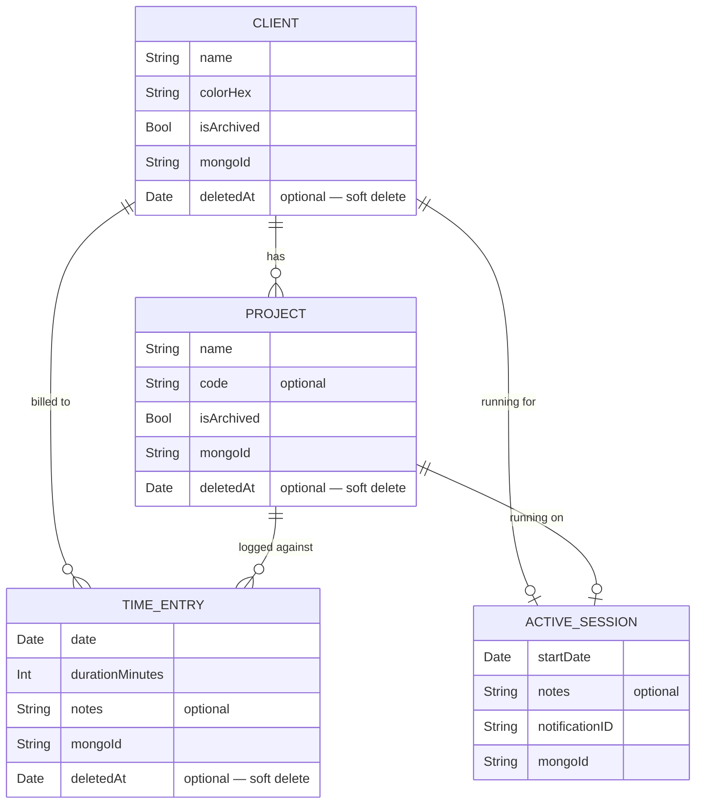
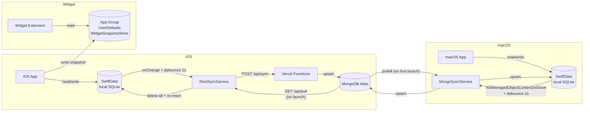

# Data Model

## Entities and relationships



## Entity descriptions

### `Client`
Represents a client. Holds the list of projects (cascade delete) and is referenced by TimeEntry and ActiveSession.

- `colorHex` — identifying colour in `#RRGGBB` format, exposed as `Color` via `Color+Hex`
- `mongoId` — MongoDB `ObjectId` serialised as a string (assigned on first upsert)
- `deletedAt` — logical deletion date (`nil` = active); used by the soft-delete strategy during sync
- Relationship with `Project`: deleteRule `.cascade` — deleting a client removes all its projects

### `Project`
Project belonging to a client. The `code` field is optional (job number, e.g. "PRJ-001").

- Relationship with `TimeEntry`: deleteRule `.nullify` — deleting a project does not delete entries, just unlinks them
- `mongoId` — same as above
- `deletedAt` — same as above (soft delete)

### `TimeEntry`
A logged time record. The core data structure of the app.

- `durationMinutes` — duration in whole minutes; formatted via `Int.formattedDuration` ("1h 30m")
- `client` and `project` are optional — an entry can be unassigned
- `deletedAt` — same as above (soft delete)

### `ActiveSession`
An in-progress tracking session. At most one per active client/project combination. Has no `deletedAt` because it is converted into a `TimeEntry` on stop — it is never logically deleted.

- `client` and `project` optional — a session can be unassigned
- `notes` — optional notes transferred to the `TimeEntry` on stop
- `mongoId` — same as above; the session is multi-device syncable
- `elapsedDisplay` — `"HH:MM:SS"` string computed at runtime from `startDate`
- `elapsedMinutes` — computed integer, used to estimate duration before stopping
- `notificationID` — ID of the UNUserNotification for the open-session reminder; cancelled on stop

## Persistence



### WidgetSnapshotStore
Widgets do not access SwiftData directly. The app writes a serialised snapshot to a shared `App Group` (`group.me.albz.timelog`).

```
TimelogWidgetSnapshot
 ├─ date: Date
 ├─ loggedMinutes: Int          ← minutes logged today
 ├─ activeSessions: [...]       ← active sessions
 ├─ lastClientName: String?
 └─ lastProjectName: String?
```

## MongoId and upsert strategy

Every SwiftData entity has a `mongoId: String?` field used as the sync key by both implementations.

### iOS pull (RestSyncService)
The pull **deletes all** local data and re-inserts from scratch what the server returns. It is not an incremental upsert — it is a full replacement. The `willWipeDataNotification` notification is posted before deletion to let views silence animations during the wipe.

| Step | Action |
|------|--------|
| 1. Wipe | Delete all TimeEntry, then Project, then Client from SwiftData |
| 2. Insert clients | Create each `Client` with `mongoId = dto._id`, save context |
| 3. Insert projects | Create each `Project`, link `Client` via `clientMongoId`, save |
| 4. Insert entries | Create each `TimeEntry`, link Client and Project via mongoId, save |

### macOS pull (MongoSyncService)
Uses incremental upsert: finds each document by `mongoId` in SwiftData and updates if found, creates if absent.

### Push (both platforms)
Each entity is serialised with its `mongoId` and sent to the server (Vercel for iOS, MongoKitten for macOS) via upsert on `_id`.
