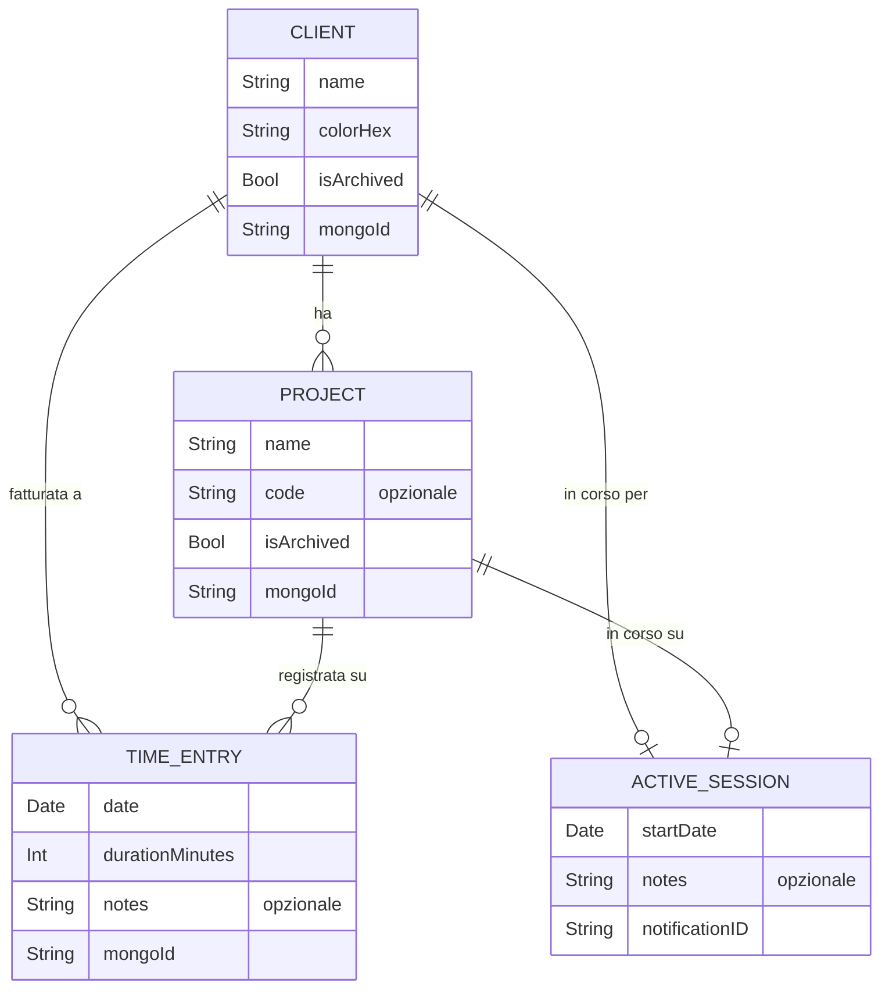
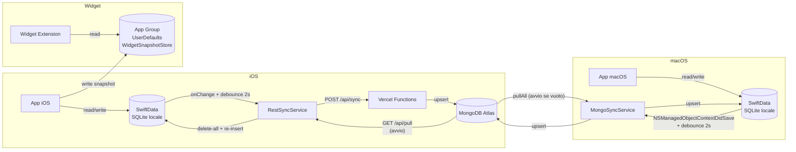

# Modello Dati

## Entità e relazioni



## Descrizione entità

### `Client`
Rappresenta un cliente. Contiene la lista di progetti (cascade delete) e viene usato come riferimento nelle TimeEntry e nelle ActiveSession.

- `colorHex` — colore identificativo in formato `#RRGGBB`, esposto come `Color` via `Color+Hex`
- `mongoId` — `ObjectId` MongoDB serializzato come stringa (assegnato al primo upsert)
- Relazione con `Project`: deleteRule `.cascade` — eliminare un client rimuove tutti i suoi progetti

### `Project`
Progetto associato a un client. Il campo `code` è opzionale (codice commessa, es. "PRJ-001").

- Relazione con `TimeEntry`: deleteRule `.nullify` — eliminare un progetto non elimina le entry, le slega
- `mongoId` — come sopra

### `TimeEntry`
Record di tempo loggato. È la struttura dati principale dell'app.

- `durationMinutes` — durata in minuti interi; formattato tramite `Int.formattedDuration` ("1h 30m")
- `client` e `project` opzionali — una entry può essere non assegnata

### `ActiveSession`
Sessione di tracking in corso. Può esisterne al massimo una per client/progetto attivo.

- `elapsedDisplay` — stringa `"HH:MM:SS"` calcolata a runtime da `startDate`
- `elapsedMinutes` — intero calcolato, usato per stimare la durata prima dello stop
- `notificationID` — ID della notifica UNUserNotification per il promemoria di sessione aperta; cancellata allo stop

## Persistenza



### WidgetSnapshotStore
I widget non accedono a SwiftData direttamente. L'app scrive un snapshot serializzato in un `App Group` condiviso (`group.me.albz.timelog`).

```
TimelogWidgetSnapshot
 ├─ date: Date
 ├─ loggedMinutes: Int          ← minuti loggati oggi
 ├─ activeSessions: [...]       ← sessioni attive
 ├─ lastClientName: String?
 └─ lastProjectName: String?
```

## MongoId e strategia di upsert

Ogni entità ha un campo `mongoId: String?` condiviso sia da `RestSyncService` che da `MongoSyncService`.

### Pull iOS (RestSyncService)
Il pull cancella **tutti** i dati locali e reinserisce da zero quanto arriva dal server. Non è un upsert incrementale — è un rimpiazzo completo. La notifica `willWipeDataNotification` viene postata prima della cancellazione per permettere alle view di silenziare animazioni durante il wipe.

| Fase | Azione |
|------|--------|
| 1. Wipe | Delete di tutte le TimeEntry, poi Project, poi Client da SwiftData |
| 2. Insert clients | Crea ogni `Client` con `mongoId = dto._id`, salva il contesto |
| 3. Insert projects | Crea ogni `Project`, linka il `Client` via `clientMongoId`, salva |
| 4. Insert entries | Crea ogni `TimeEntry`, linka Client e Project via mongoId, salva |

### Pull macOS (MongoSyncService)
Usa upsert incrementale: cerca ogni documento per `mongoId` in SwiftData e aggiorna se trovato, crea se assente.

### Push (entrambe le piattaforme)
Ogni entità viene serializzata con il proprio `mongoId` e inviata al server (Vercel per iOS, MongoKitten per macOS) tramite upsert su `_id`.
