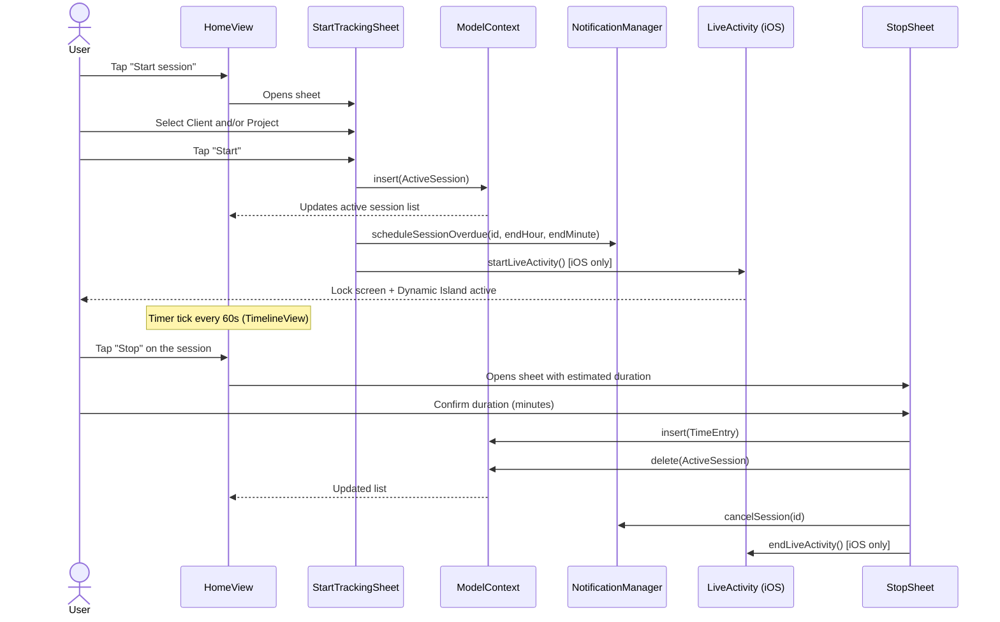
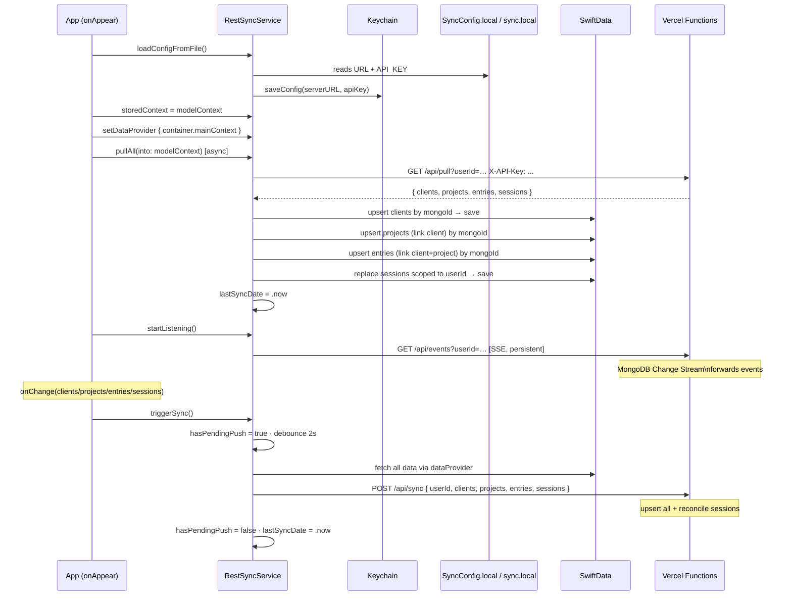
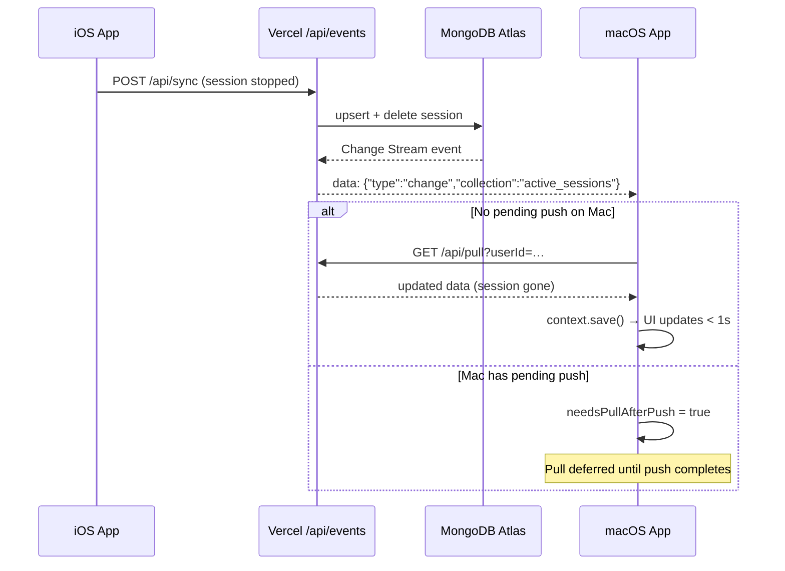
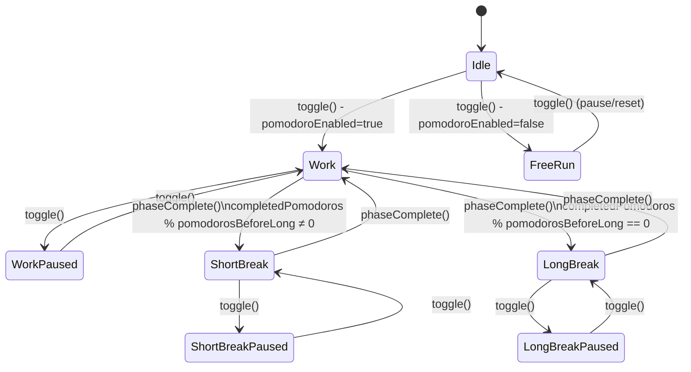
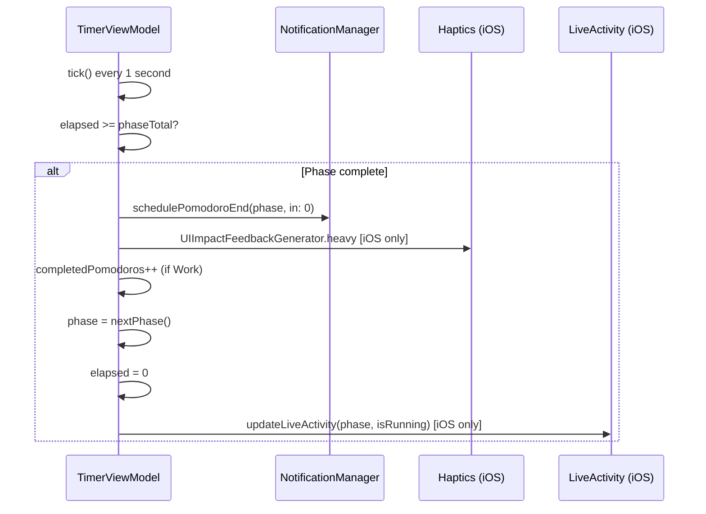
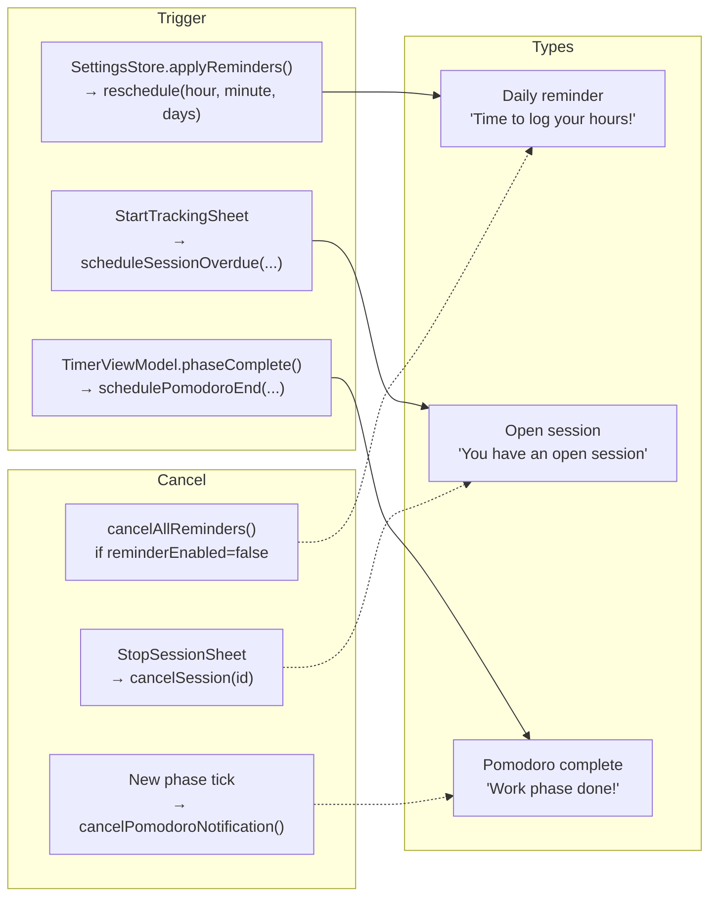
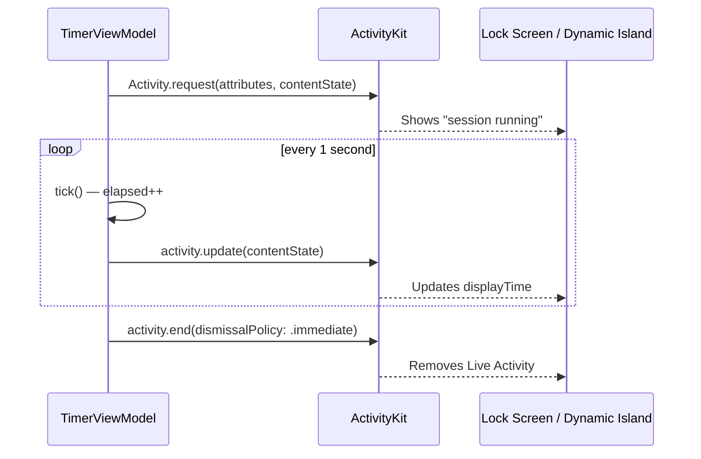
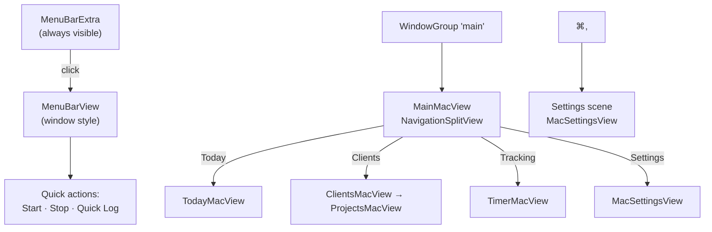
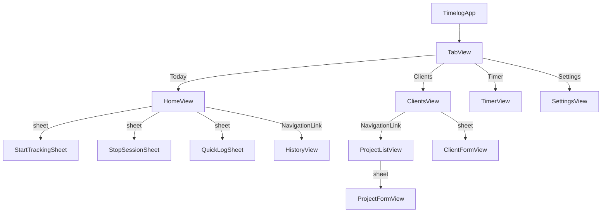

# User Flows

## 1. Time Tracking — Start and Stop



## 2. Quick Log (manual entry)

```mermaid
flowchart TD
    A([Tap Quick Log]) --> B[QuickLogSheet]
    B --> C{Client selected?}
    C -->|No| D[Log without client]
    C -->|Yes| E{Project selected?}
    E -->|No| F[Log with client only]
    E -->|Yes| G[Log with client and project]
    D & F & G --> H[insert TimeEntry\ndate=today, durationMinutes, notes]
    H --> I[Dismiss sheet]
    I --> J[HomeView updated\nSync debounced 2s → RestSyncService (both platforms)]
```

## 3. Sync — Launch sequence (iOS + macOS)



## 4. Real-time sync — SSE event flow



## 5. Pomodoro Timer



### Phase transition — detail



## 6. Notifications



## 7. Live Activity (iOS)



## 8. Navigation — macOS



## 9. Navigation — iOS


