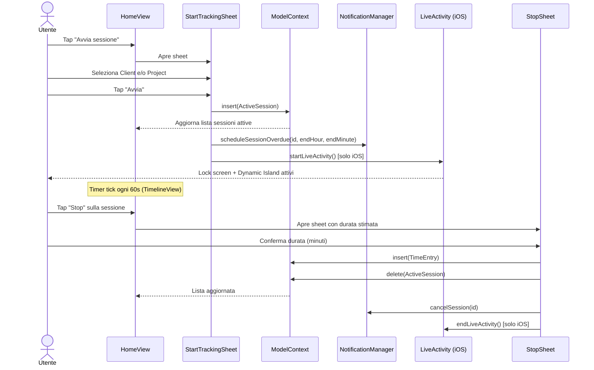
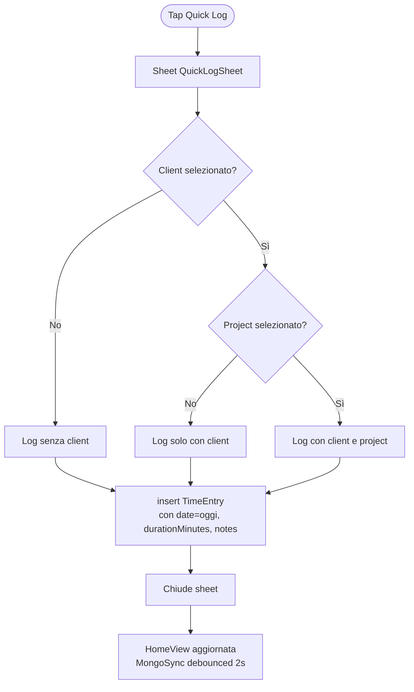
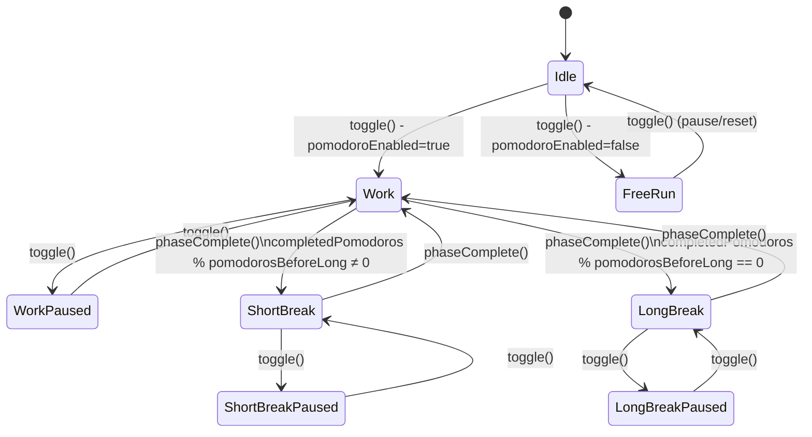
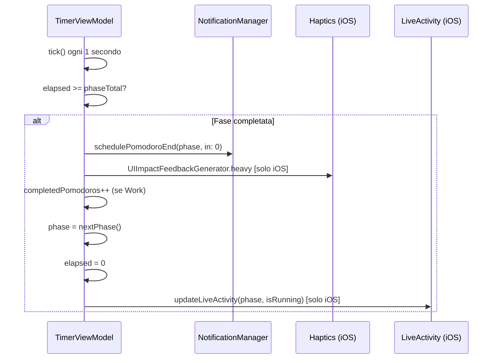
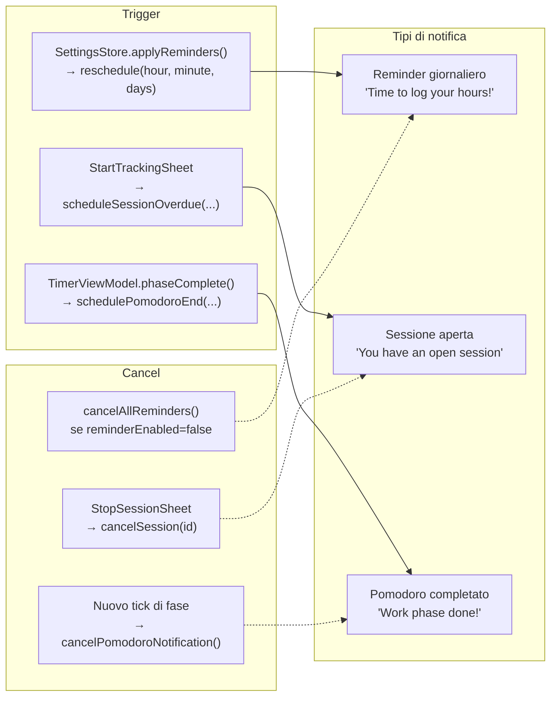
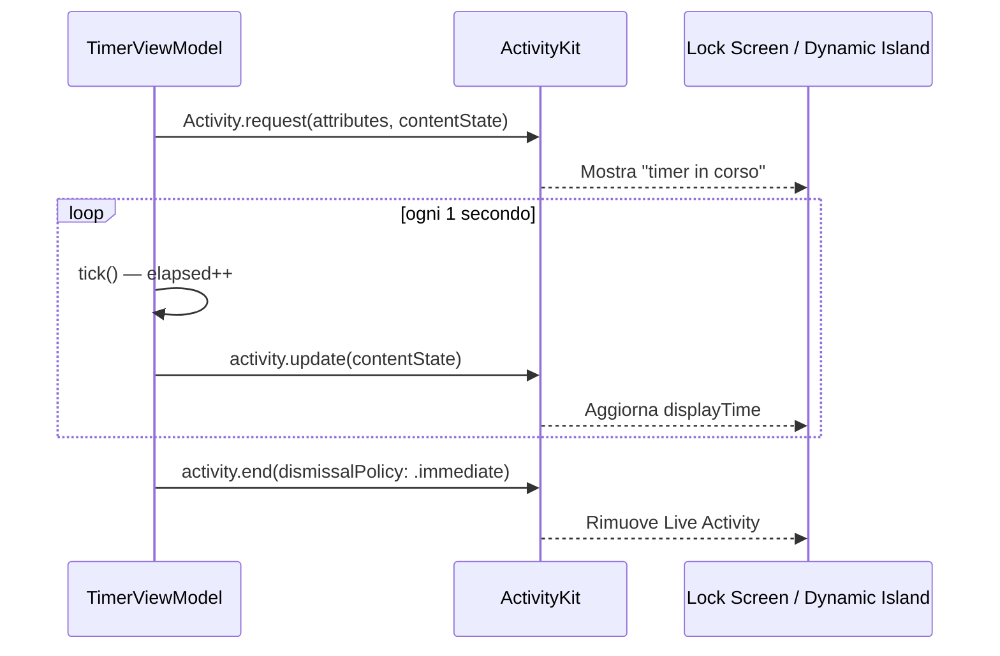
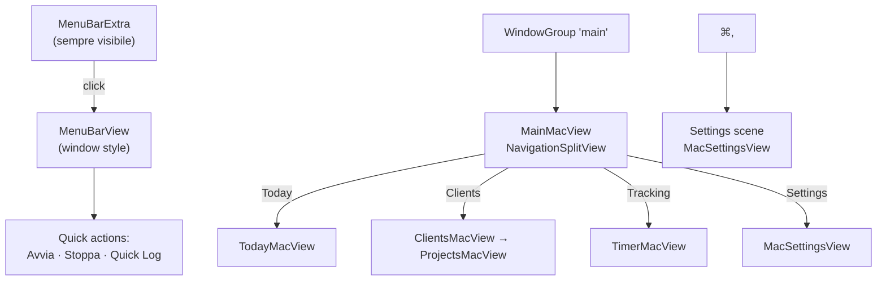
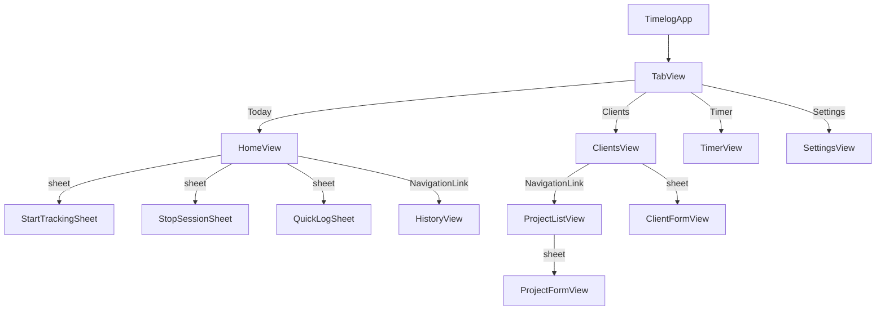

# Flussi Utente

## 1. Time Tracking — Avvio e Stop

## 2. Quick Log (log manuale)

## 3. Timer Pomodoro

### Transizione di fase — dettaglio

## 4. Notifiche

## 5. Live Activity (iOS)

## 6. Navigation — macOS

## 7. Navigation — iOS

