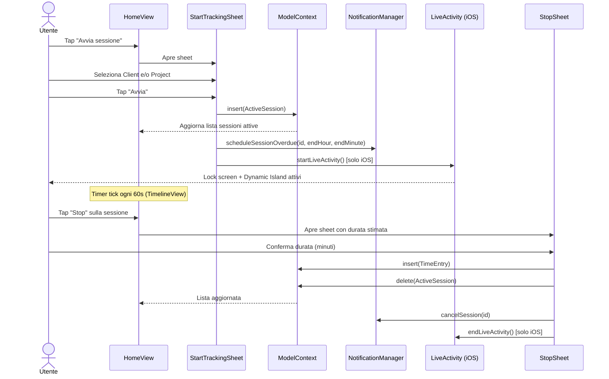
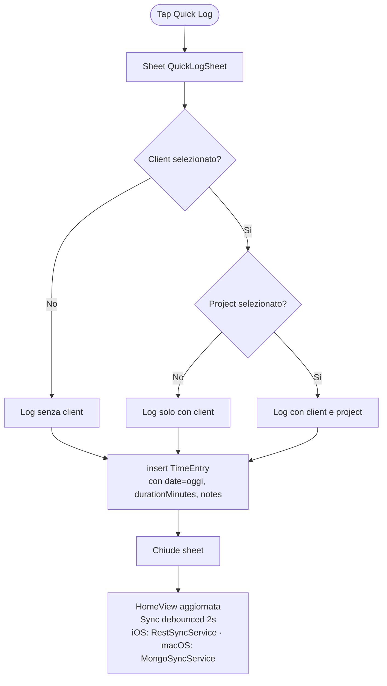
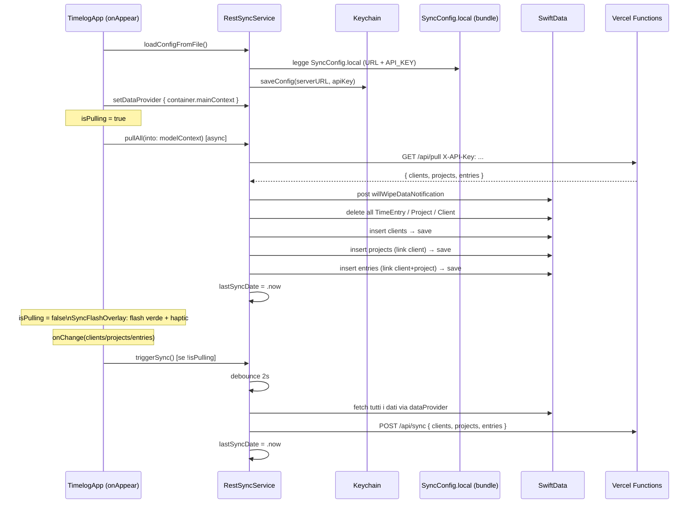
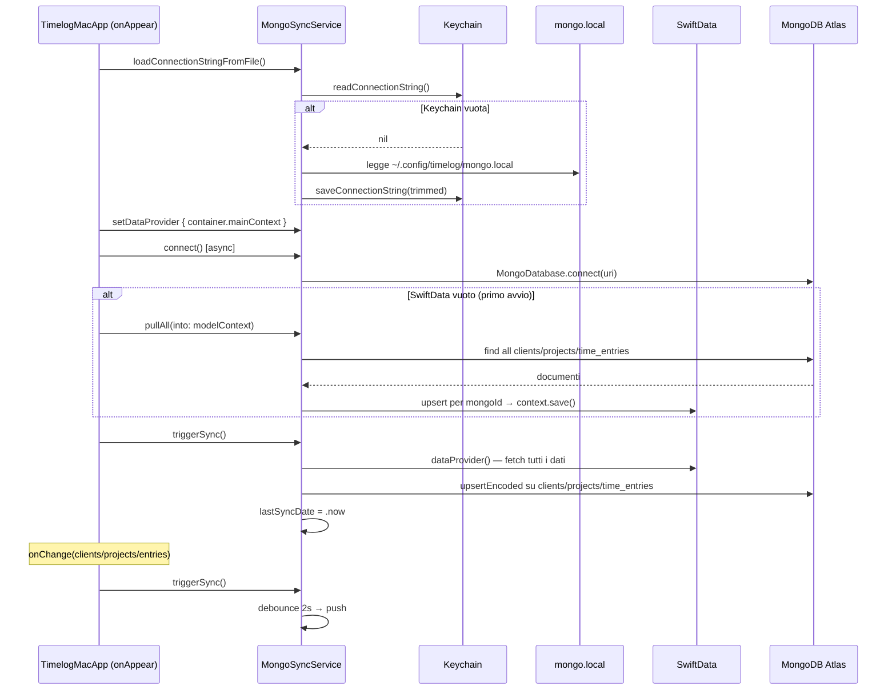
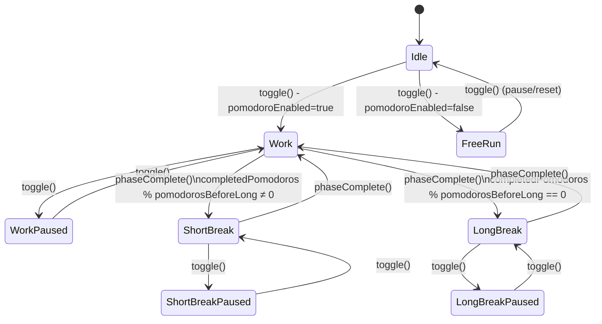
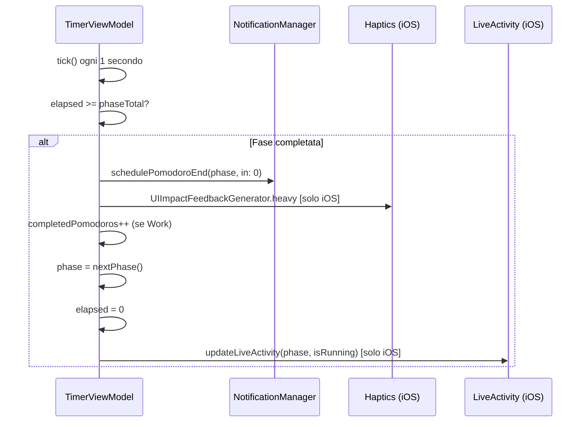
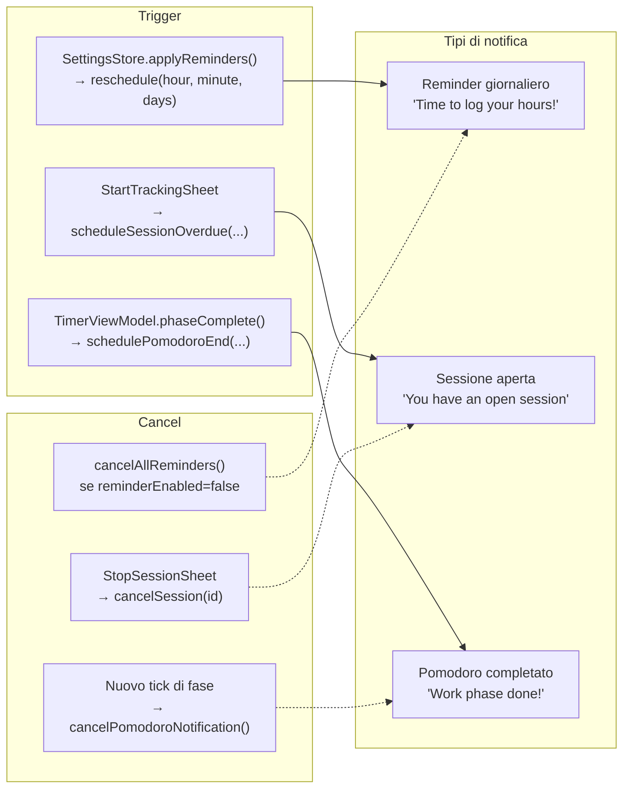
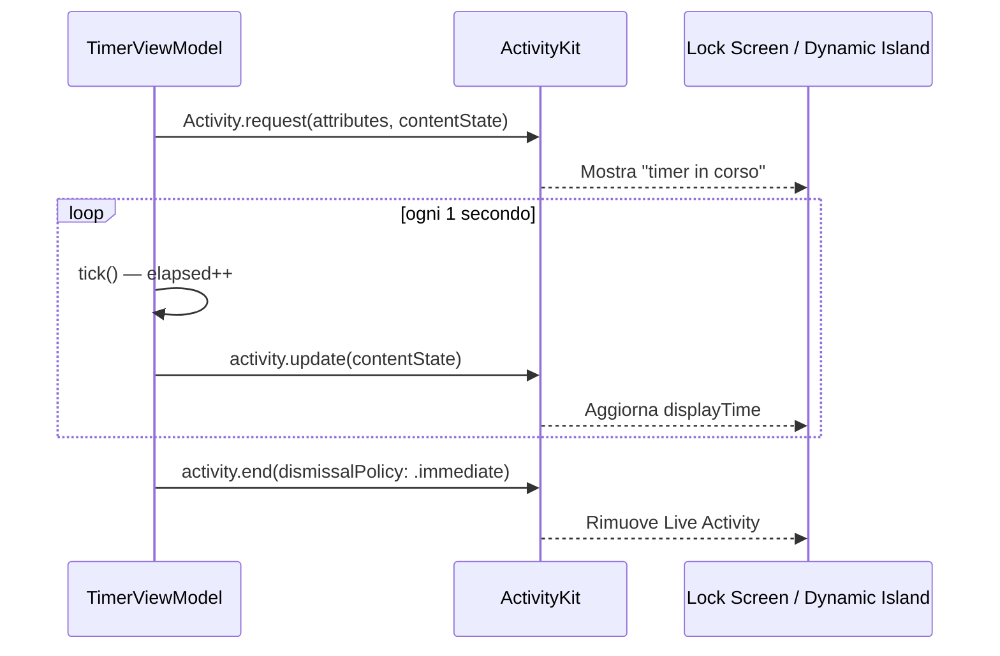
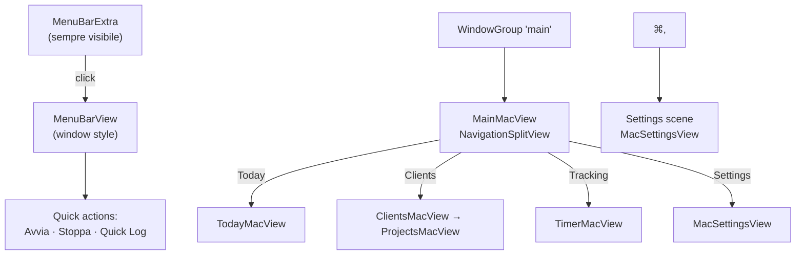
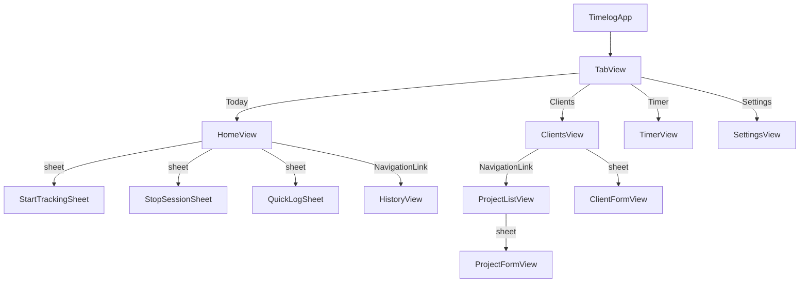

# Flussi Utente

## 1. Time Tracking — Avvio e Stop

## 2. Quick Log (log manuale)

## 3. Sync iOS — RestSyncService

## 4. Sync macOS — MongoSyncService

## 5. Timer Pomodoro

### Transizione di fase — dettaglio

## 6. Notifiche

## 7. Live Activity (iOS)

## 8. Navigation — macOS

## 9. Navigation — iOS

