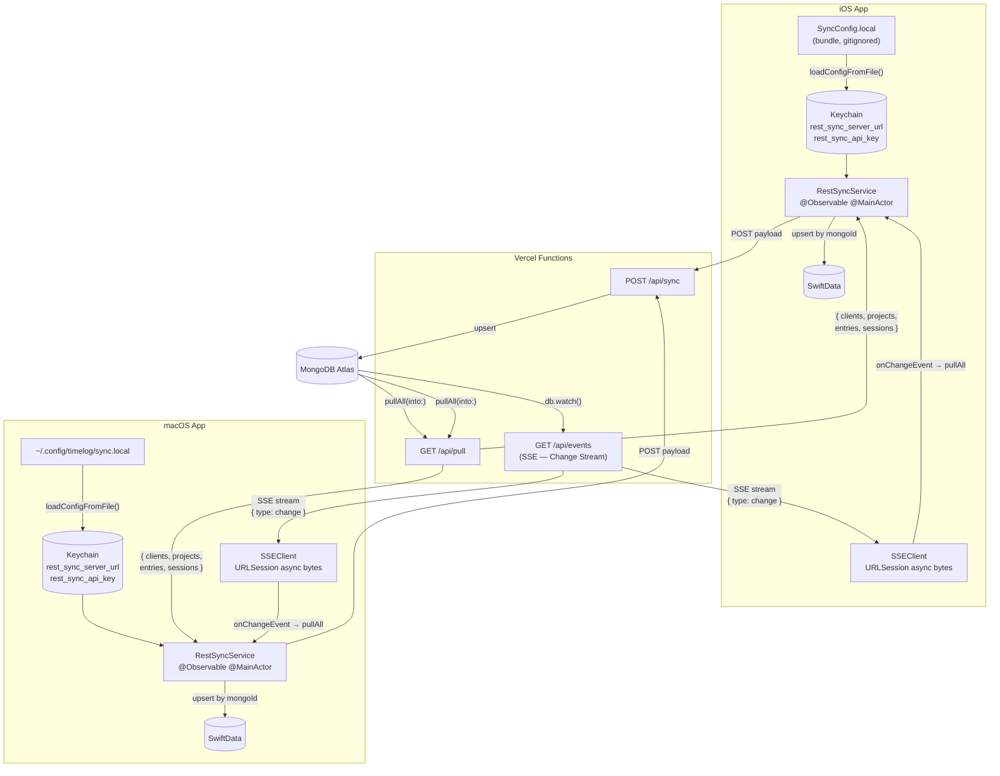

# Synchronisation

Both iOS and macOS use the same `RestSyncService` in the `TimelogSync` package.
The server is the single point of contact with MongoDB; neither client holds a
direct database connection.

| Platform | Service | Protocol |
|----------|---------|----------|
| iOS | `RestSyncService` | URLSession → Vercel Functions → MongoDB Atlas |
| macOS | `RestSyncService` | URLSession → Vercel Functions → MongoDB Atlas |

---

## Architecture



---

## Real-time sync — SSEClient

`SSEClient` opens a persistent `GET /api/events` HTTP connection using
`URLSession.bytes(for:)`. The server sends `text/event-stream` events whenever
any document in the `timelog` database changes (via MongoDB Change Streams).

On receiving a `{ "type": "change" }` event, `RestSyncService` calls `pullAll`
to download the latest snapshot. No document payload is included in the SSE
event itself — this keeps the stream lightweight and avoids data leaking through
the streaming channel.

`SSEClient` reconnects automatically with exponential backoff (1 s → 2 s → 4 s →
max 30 s) on any error or server-side disconnect (Vercel functions close after
300 s).

### Race-condition guard

When `triggerSync()` is called (local data changed), `RestSyncService` sets
`hasPendingPush = true`. If an SSE event arrives while a push is queued or
in-flight, the pull is deferred (`needsPullAfterPush = true`) and executed after
the push completes. This prevents a server pull from restoring data the user has
just deleted locally.

If `isUserEditing` is `true` (a form is open on macOS), SSE-triggered pulls are
also deferred until the form closes.

---

## Launch sequence

1. `loadConfigFromFile()` — reads credentials from `SyncConfig.local` (iOS bundle)
   or `~/.config/timelog/sync.local` (macOS), saves to Keychain if empty
2. `setDataProvider` — registers the closure that fetches all data from
   `container.mainContext`
3. `storedContext = modelContext` — stored for SSE-triggered pulls
4. `pullAll(into:)` — downloads the current server snapshot
5. `startListening()` — opens the SSE stream

---

## Auto-push

`onChange` on clients / projects / entries / sessions → `triggerSync()` →
debounce 2 s → `POST /api/sync`

The push payload carries a top-level `userId`. The server upserts every
collection and then **reconciles sessions**: any `active_sessions` document for
that `userId` not in the payload is deleted, so a session stopped on one device
does not reappear as a "ghost" session on the next pull.

---

## Configuration

### iOS

```
# Timelog/SyncConfig.local (gitignored, included in iOS bundle)
URL=https://your-app.vercel.app
API_KEY=your-secret-key
```

### macOS

```bash
mkdir -p ~/.config/timelog

cat > ~/.config/timelog/sync.local << 'EOF'
URL=https://your-app.vercel.app
API_KEY=your-secret-key
EOF

chmod 600 ~/.config/timelog/sync.local
```

On first launch `loadConfigFromFile()` reads either file and saves the
credentials to Keychain. No manual input in Settings is required.

---

## Observable state

| Property | Type | Meaning |
|----------|------|---------|
| `isSyncing` | `Bool` | Pull or push in progress |
| `lastSyncDate` | `Date?` | Timestamp of last successful sync |
| `lastError` | `String?` | Last error (nil if OK) |
| `isConfigured` | `Bool` | URL and API key present in Keychain |
| `sseState` | `SSEClient.State` | disconnected / connecting / connected / error |
| `isUserEditing` | `Bool` | True while a modal form is open (macOS) |

---

## Server endpoints

| Method | Path | Purpose |
|--------|------|---------|
| `GET` | `/api/pull?userId=…` | Returns all 4 collections scoped to `userId` |
| `POST` | `/api/sync` | Bulk-upserts all collections, reconciles sessions |
| `GET` | `/api/events?userId=…` | SSE stream — notifies clients of any DB change |

---

## MongoDB document schema

Documents written by both platforms are identical.

### `clients`
```json
{ "_id": ObjectId, "name": "Acme", "colorHex": "#FF5733", "isArchived": false, "userId": "alice", "deletedAt": null }
```

### `projects`
```json
{ "_id": ObjectId, "name": "Website", "code": "PRJ-01", "labels": ["frontend"], "clientMongoId": "64abc...", "userId": "alice", "deletedAt": null }
```

### `time_entries`
```json
{ "_id": ObjectId, "date": "2025-05-15T09:00:00.000Z", "durationMinutes": 90, "notes": "...", "label": "...", "clientMongoId": "...", "projectMongoId": "...", "userId": "alice", "deletedAt": null }
```

### `active_sessions`
```json
{ "_id": ObjectId, "startDate": "2025-05-15T09:00:00.000Z", "notes": "...", "label": "...", "clientMongoId": "...", "projectMongoId": "...", "notificationID": "...", "userId": "alice" }
```

> **`deletedAt`**: applies to `clients`, `projects`, and `time_entries` only.
> `active_sessions` have no `deletedAt` — a stopped session is hard-deleted and
> reconciled server-side per `userId`.

> **`userId`**: every document includes a `userId` field so multiple users can
> share a single MongoDB database. A compound index on `{ userId: 1, _id: 1 }`
> is recommended for each collection.

---

## mongoId strategy

| Scenario | Behaviour |
|----------|-----------|
| Pull — document found by `mongoId` | Update fields in-place |
| Pull — document not found | Insert new entity with `mongoId = server _id` |
| Push — `mongoId` present | Use as `_id` for upsert on the server |
| Push — `mongoId` absent | Server generates a new `_id` |
